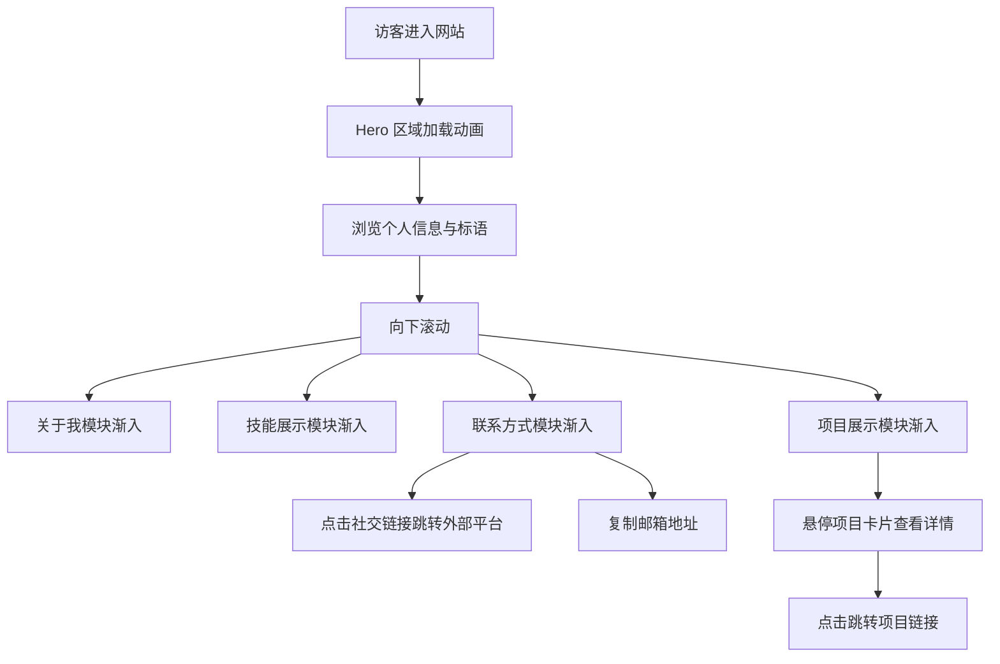

## 1. 产品概述

为前端开发者打造的个人品牌展示网站首页，通过炫酷的视觉设计和流畅的动画效果，展示开发者的技能、项目和个性。目标用户为潜在雇主、合作者和技术社区成员，旨在建立专业可信且富有创意的个人品牌形象。

## 2. 核心功能

### 2.1 用户角色

| 角色 | 注册方式 | 核心权限 |
|------|----------|----------|
| 访客 | 无需注册 | 浏览所有内容、查看项目、复制联系方式 |

### 2.2 功能模块

1. **Hero 区域**：全屏视差背景动画、开发者姓名与职业标语、CTA 按钮引导
2. **关于我**：个人简介、开发哲学、经验亮点
3. **技能展示**：技术栈图标展示，分类排列（前端框架 / 工具 / 语言等）
4. **项目展示**：精选项目卡片，悬停 3D 翻转 / 倾斜效果，链接到项目详情
5. **联系方式**：社交媒体链接、邮箱展示、可能的联系表单

### 2.3 页面详情

| 页面名称 | 模块名称 | 功能描述 |
|----------|----------|----------|
| 首页 | Hero 区域 | 全屏展示，粒子/代码流动背景动画，姓名打字机效果，职业标语渐入，CTA 按钮脉冲动画 |
| 首页 | 导航栏 | 固定顶部，玻璃态半透明背景，滚动时样式变化，移动端汉堡菜单 |
| 首页 | 关于我 | 个人介绍段落，左侧文字 + 右侧装饰性动画图形，滚动触发渐入 |
| 首页 | 技能展示 | 分类卡片排列，图标悬浮旋转/缩放，技能熟练度动画进度条 |
| 首页 | 项目展示 | 卡片网格布局，悬停3D倾斜效果，渐变边框发光，项目标签与描述 |
| 首页 | 联系方式 | 社交图标涟漪动画，邮箱一键复制，装饰性背景光晕 |
| 首页 | 页脚 | 版权信息，回到顶部按钮，简洁设计 |

## 3. 核心流程

## 4. 用户界面设计

### 4.1 设计风格

**主题方向：赛博琉璃 (Cyber-Glass)**

整体采用深色太空背景搭配霓虹渐变色彩，大量使用玻璃拟态 (Glass Morphism) 效果，营造出"透过全息玻璃窥见数字宇宙"的视觉感受。

- **主色调**：深邃太空黑 `#050510` → `#0a0a1f`
- **强调色1（青霓）**：`#00e5ff` - 用于主要交互元素、链接、图标高亮
- **强调色2（紫霓）**：`#b44dff` - 用于渐变辅助、装饰元素
- **强调色3（粉霓）**：`#ff2d95` - 用于点缀、CTA 按钮
- **玻璃背景**：`rgba(255,255,255,0.03)` + `backdrop-blur`
- **玻璃边框**：`rgba(255,255,255,0.08)`
- **文字主色**：`#e8e8f0`
- **文字次要色**：`#8888a0`

- **字体选择**：
  - 主标题展示字：**Orbitron**（几何未来感，用于 Hero 名称）
  - 章节标题：**Rajdhani**（几何现代感，用于各 Section 标题）
  - 正文：**Noto Sans SC**（中文阅读舒适）
  - 代码/技术标签：**JetBrains Mono**（等宽，开发者属性）
  
- **按钮风格**：霓虹发光边框按钮，悬停时边框光晕扩散，带渐变背景过渡
- **布局风格**：单页滚动，各模块交替全宽与约束宽度布局，大量负空间
- **图标风格**：SVG 图标库（Lucide Icons / Simple Icons），线条风格 + 霓虹色

### 4.2 页面设计概览

| 页面名称 | 模块名称 | UI 元素 |
|----------|----------|---------|
| 首页 | Hero 区域 | 全屏高度，Canvas 粒子背景（代码字符流动效果），中央大标题 Orbitron 字体，姓名打字动画，副标题渐入，下方 CTA 按钮脉冲发光，滚动指示器弹跳动画 |
| 首页 | 导航栏 | 固定顶部，模糊玻璃背景，Logo 左侧，导航链接右侧（关于/技能/项目/联系），滚动到对应模块高亮当前项，移动端汉堡图标展开全屏菜单 |
| 首页 | 关于我 | 左右两栏布局，左侧大段文字带渐变高亮关键词，右侧抽象几何图形旋转动画（CSS 3D），整体滚动渐入 |
| 首页 | 技能展示 | 技能分类卡片（前端/工具/语言等），每张卡片玻璃态背景，图标网格排列，悬浮时图标依次弹跳动画，分类标题 Rajdhani 字体 |
| 首页 | 项目展示 | 2-3列网格，项目卡片带渐变发光边框（hover时显现），卡片内含项目截图占位、标题、技术标签、描述，悬停3D倾斜 (perspective + rotateX/Y)，点击区域覆盖整个卡片 |
| 首页 | 联系方式 | 居中布局，大标题 + 社交图标行，图标悬浮旋转+缩放+发光，邮箱带复制按钮（点击后tooltip反馈），背景装饰径向渐变光晕 |
| 首页 | 页脚 | 简洁单行，左侧版权，右侧回到顶部按钮（圆形悬浮），分隔线带渐变 |

### 4.3 响应式设计

- **桌面端优先**（≥1024px）：完整布局，多列网格，全动画效果
- **平板端**（768px-1023px）：双列布局，缩减部分动画
- **移动端**（<768px）：单列堆叠，简化粒子背景，保留核心动画，触摸友好间距

### 4.4 动画设计

- **页面加载**：Hero 粒子背景立即渲染 → 标题字符逐个弹出（stagger 50ms）→ 副标题渐入（delay 800ms）→ CTA 按钮弹入（delay 1200ms）
- **滚动触发**：使用 Intersection Observer，各模块从下方渐入 + 轻微上移（translateY: 30px → 0）
- **悬停效果**：技能图标旋转+缩放，项目卡片 3D 倾斜，社交图标发光扩散
- **持续动画**：粒子背景持续流动，Hero 区域装饰光晕缓慢漂移，技能分类标题下划线脉冲
- **滚动视差**：Hero 背景粒子随滚动减速移动（轻微视差效果）