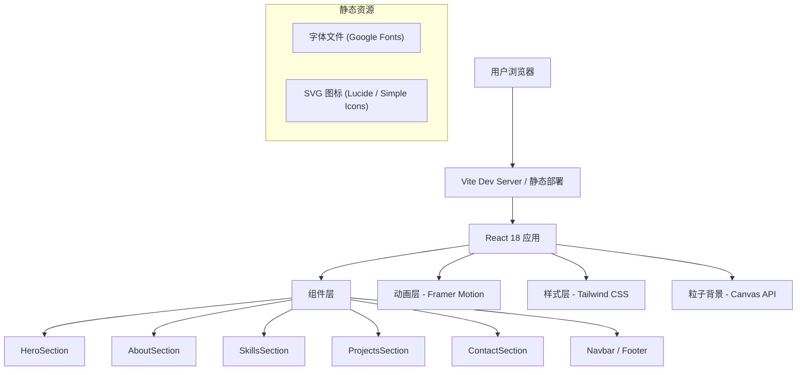

## 1. 架构设计



## 2. 技术选型

- **前端框架**：React 18 + TypeScript
- **构建工具**：Vite 5
- **样式方案**：Tailwind CSS 3 + 自定义 CSS 变量
- **动画库**：Framer Motion 11（React 动画生态最强库）
- **图标库**：Lucide React（轻量 SVG 图标）
- **字体**：Google Fonts（Orbitron + Rajdhani + Noto Sans SC + JetBrains Mono）
- **粒子背景**：原生 Canvas API（轻量高性能，无额外依赖）
- **后端**：无（纯静态站点）

## 3. 路由定义

| 路由 | 用途 |
|------|------|
| `/` | 首页（单页应用，所有模块在同一页面，通过锚点导航） |

## 4. 组件树结构

```
App
├── Navbar (固定顶部导航)
├── ParticleBackground (Canvas 粒子背景层)
├── HeroSection
│   ├── TypeWriterText (打字机效果组件)
│   └── CTAButton (脉冲发光按钮)
├── AboutSection
│   └── AnimatedGeometry (装饰几何图形)
├── SkillsSection
│   └── SkillCard[] (技能分类卡片)
├── ProjectsSection
│   └── ProjectCard[] (项目展示卡片，含 3D 倾斜)
├── ContactSection
│   └── SocialIcon[] (社交链接图标)
└── Footer
    └── BackToTop (回到顶部按钮)
```

## 5. 数据模型

所有数据使用 TypeScript 静态常量定义，无需数据库。

```typescript
interface PersonalInfo {
  name: string;
  title: string;
  tagline: string;
  bio: string;
  email: string;
  socialLinks: SocialLink[];
}

interface SocialLink {
  platform: string;
  url: string;
  icon: string;
}

interface SkillCategory {
  name: string;
  skills: Skill[];
}

interface Skill {
  name: string;
  icon: string;
  level: number; // 0-100
}

interface Project {
  title: string;
  description: string;
  tags: string[];
  image?: string;
  link?: string;
  github?: string;
}
```

## 6. 性能优化策略

- 粒子 Canvas 使用 `requestAnimationFrame` + 对象池模式，控制粒子数量
- 图片使用懒加载（Intersection Observer）
- Framer Motion 的 `whileInView` 使用 `once: true` 避免重复触发
- Tailwind CSS purging 去除未使用样式
- 字体使用 `font-display: swap` 避免 FOIT